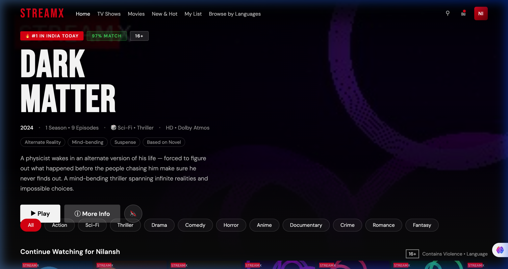
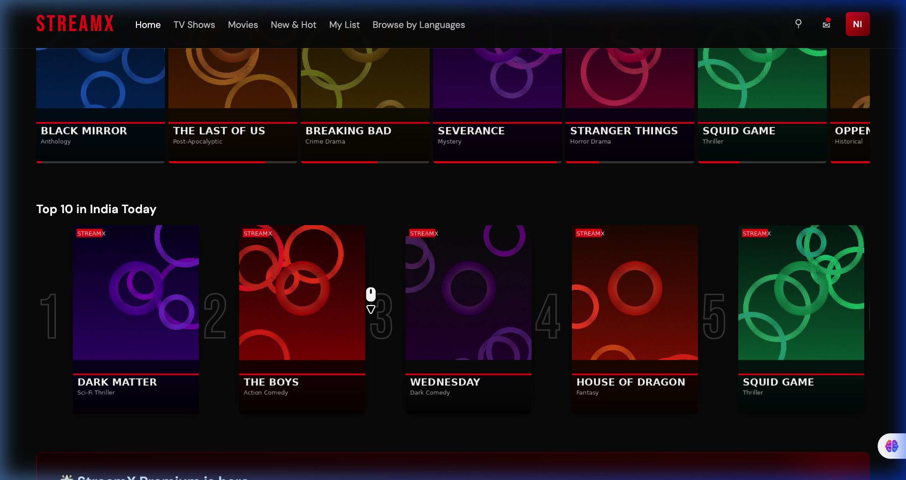
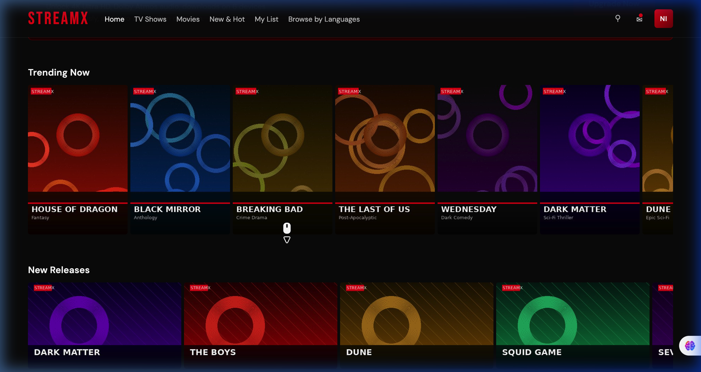
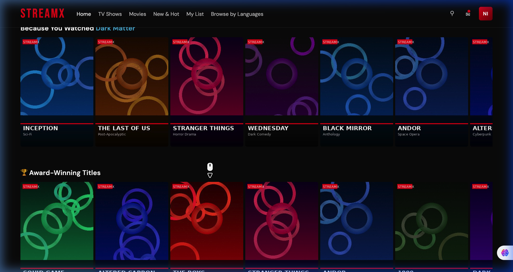

# 🎬 StreamX — Watch Anywhere

A **Netflix-inspired streaming platform UI** built with pure HTML, CSS, and JavaScript. No frameworks, no dependencies — just clean, premium front-end code.

> ✅ Single-file app — open `StreamX.html` in any browser and it just works!

---

## ✨ Features

- 🎥 **Hero Section** — Full-screen featured show banner with Play / More Info / Mute buttons
- 🔥 **Continue Watching** — Horizontally scrollable card row with progress bars
- 🏆 **Top 10 in India Today** — Ranked cards with bold numeric overlays
- 📢 **Premium Banner** — Upgrade prompt with gradient design
- 🌊 **Trending Now** — Portrait card row with hover overlays
- 🆕 **New Releases** — Landscape card row with match % tooltips
- 🧠 **Because You Watched** — Personalized recommendations row
- 🏅 **Award-Winning Titles** — Curated carousel with Explore All
- 🔍 **Search Overlay** — Live search with blur backdrop
- 🎭 **Detail Modal** — Full show info popup with "More Like This" grid
- 🏷️ **Genre Filter Strip** — One-click filter by genre (All, Action, Sci-Fi, etc.)
- 🍞 **Toast Notifications** — Subtle feedback on user actions
- 📱 **Responsive Design** — Works on desktop and mobile
- 🌑 **Dark Mode** — Pure black background with Netflix-like aesthetic
- ✨ **Micro-animations** — Hover scale, scroll transitions, smooth reveals

---

## 🚀 Getting Started

No install needed! Just open the file:

```bash
# Clone the repo
git clone https://github.com/nilansh-sinha/StreamX.git

# Open in browser
open StreamX.html
```

Or simply [download StreamX.html](./StreamX.html) and open it directly.

---

## 📸 Screenshots

### Hero Section — Featured Show


### Continue Watching + Top 10


### Trending & New Releases


### Because You Watched + Award-Winning


---

## 🛠️ Tech Stack

| Technology | Usage |
|------------|-------|
| **HTML5** | Semantic structure |
| **CSS3** | Custom properties, Flexbox, Grid, animations |
| **Vanilla JS** | Dynamic card rendering, search, modals |
| **Google Fonts** | Bebas Neue + DM Sans |
| **Canvas-generated images** | AI-style gradient show thumbnails |

---

## 🎨 Design Highlights

- **Color palette**: `#e50914` (red), `#0a0a0a` (dark), `#141414` (surface)
- **Typography**: Bebas Neue (headings) + DM Sans (body)
- **Card hover effect**: 1.08× scale with overlay reveal
- **Scrollable rows**: Custom scroll buttons revealed on hover
- **Modal**: 16:9 hero image with gradient overlay + show metadata

---

## 📁 Project Structure

```
StreamX/
├── StreamX.html          # Complete single-file app
├── screenshots/          # UI screenshots
│   ├── screenshot1.png
│   ├── screenshot2.png
│   ├── screenshot3.png
│   └── screenshot4.png
└── README.md
```

---

## 👤 Author

Made by **Nilansh** — [GitHub @nilansh-sinha](https://github.com/nilansh-sinha)

---

## 📄 License

This project is open source under the [MIT License](LICENSE).
